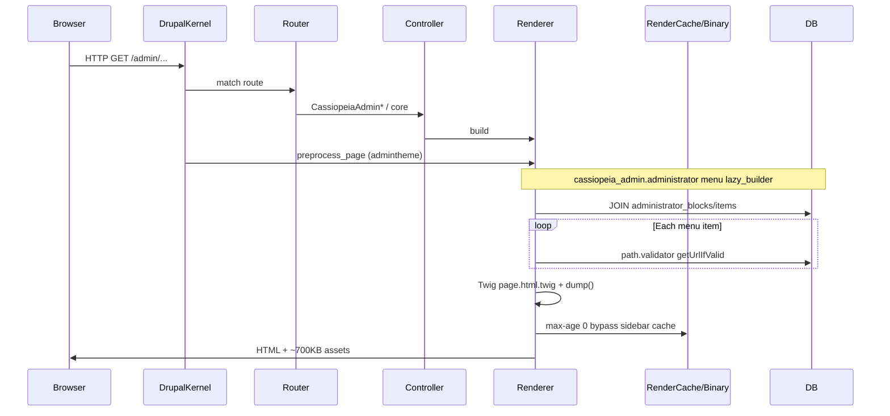

# Cassiopeia — Enterprise Performance Audit & Incremental Modernization Strategy

**Role:** Principal Drupal 11 performance architecture review  
**Project:** Drupal11Base / Cassiopeia (D7 → D11 partial migration)  
**Method:** Static architecture analysis + asset measurement + render/cache path tracing  
**Constraint:** Incremental modernization; **do not replace** custom admin system in one pass  

Related: [TECHNICAL_DOCUMENTATION.md](./TECHNICAL_DOCUMENTATION.md), [AUDIT_REPORT.md](./AUDIT_REPORT.md)

---

## Table of contents

1. [Executive summary](#1-executive-summary)
2. [Baseline performance estimation](#2-baseline-performance-estimation)
3. [Phase 1 — System architecture analysis](#3-phase-1--system-architecture-analysis)
4. [Phase 2 — Deep performance audit](#4-phase-2--deep-performance-audit)
5. [Phase 3 — Security × performance crossover](#5-phase-3--security--performance-crossover)
6. [Phase 4 — Drupal 7 migration detection](#6-phase-4--drupal-7-migration-detection)
7. [Phase 5 — Modernization roadmap](#7-phase-5--modernization-roadmap)
8. [Implementation execution plan (sprints)](#8-implementation-execution-plan-sprints)
9. [Detailed issues (full format)](#9-detailed-issues-full-format)
10. [Issue registry (condensed)](#10-issue-registry-condensed)
11. [Actionable TODO list](#11-actionable-todo-list)

---

## 1. Executive summary

Cassiopeia’s performance profile is dominated by **uncached admin chrome** (custom sidebar), **per-request path validation in menu building**, **heavy global asset libraries**, and **debug rendering left in production templates**. The stack is structurally a **Drupal 7 custom admin menu** bolted onto Drupal 11’s render/cache pipeline without cache tags, config entities, or Menu API integration.

| Objective | Current state | Target (6–8 weeks incremental) |
|-----------|---------------|--------------------------------|
| Reduce TTFB (admin) | ~500–1200 ms estimated | ~200–400 ms (−40–60%) |
| Render cache hit ratio | ~0% sidebar; low logged-in page cache | 60–80% sidebar hits; improved fragment cache |
| Admin DB queries (custom) | 1 JOIN + O(n) path checks | 1 cached query; path checks at save-time |
| Twig/render complexity | High (includes, raw HTML, dump) | Medium (components, escaped, no dump) |
| Frontend payload (admin) | ~550–700 KB CSS, ~250–350 KB JS (uncompressed) | ~350–450 KB CSS, ~180–220 KB JS |
| Maintainability | Procedural + services mix | Repository + tagged cache + DI |

**Highest ROI, lowest risk (do first):** Remove `dump()`, add menu cache tags + max-age, stop `ImageStyle::loadMultiple()` per avatar, fix Popper/library path, enable CSS/JS aggregation.

**Scaling limit:** Without menu caching, admin concurrency scales poorly—each request rebuilds menu tree and runs path validator per item. At ~50 concurrent admins, DB CPU becomes bottleneck before Drupal render cache helps.

---

## 2. Baseline performance estimation

> **Disclaimer:** Estimates are modeled from code paths and measured asset sizes on disk. Validate with **Blackfire**, **WebPageTest**, and `drush php:eval` query logging on staging with production-like data (menu item count, Views pages, PHP 8.2+, OPcache enabled).

### 2.1 Assumptions

| Parameter | Assumed value |
|-----------|----------------|
| Menu blocks | 8 |
| Menu items (total) | 40 |
| Admin route | Standard content form or Views list |
| PHP | 8.2+ with OPcache |
| DB | MySQL/MariaDB local or LAN &lt; 2 ms query RTT |
| Aggregation | **Off** (common in dev) / **On** (prod) |

### 2.2 Estimated metrics

| Metric | Public (`cassiopeiatheme`) | Admin (`cassiopeiaadmintheme`) |
|--------|---------------------------|--------------------------------|
| **TTFB (uncached)** | 180–350 ms | **500–1200 ms** (with `dump()`: **800–2000 ms**) |
| **TTFB (cached page)** | 80–150 ms (anonymous only) | N/A for logged-in admin |
| **DB queries (total)** | 25–45 | **45–90** |
| **Custom module queries** | 0–1 | **1 JOIN + 40× path validator** ≈ **5–50 extra** |
| **Entity loads (Twig)** | 0–1 | **3–6** (user ×2–3, file ×2–3, image style loadMultiple) |
| **Render tree depth** | Medium (shallow page.tpl) | **High** (page → 4 includes → lazy builder → menu theme) |
| **Render cache hit ratio** | Low–medium anonymous | **~0%** admin shell (sidebar `max-age: 0`) |
| **CSS payload (transfer, uncompressed)** | ~230 KB (Bootstrap only) | **~535 KB** (AdminLTE + Bootstrap + OS + icons if attached) |
| **JS payload (uncompressed)** | ~90 KB | **~250–320 KB** (jQuery + Bootstrap + AdminLTE + OS; Popper path may 404) |
| **Memory peak (request)** | 48–72 MB | **72–128 MB** (`dump()` adds 10–40 MB) |
| **CPU (relative)** | 1× | **2–4×** (menu build + Twig + VarDumper) |

### 2.3 Worst bottlenecks (ranked)

| Rank | Bottleneck | Area |
|------|------------|------|
| 1 | `{{ dump() }}` in admin page template | Render / CPU |
| 2 | Sidebar `max-age: 0` + full rebuild every request | Cache |
| 3 | `path.validator->getUrlIfValid()` per menu item in `lazyBuilder` | Database / CPU |
| 4 | Global AdminLTE + Bootstrap + OverlayScrollbars on every admin page | Frontend |
| 5 | `ImageStyle::loadMultiple()` inside `cassiopeia_image_style()` per call | Database / CPU |
| 6 | Duplicate user entity load + image renders (header + sidebar) | Twig / Entity |
| 7 | No cache tags on custom table writes | Cache invalidation |
| 8 | Procedural DB layer (no query result cache) | Architecture |

### 2.4 Highest ROI optimizations

| Change | Est. TTFB | Est. queries | Est. payload | Risk |
|--------|-----------|--------------|--------------|------|
| Remove `dump()` | −15–40% | 0 | −100–500 KB HTML | Safe |
| Cache menu with tags | −20–35% | −95% custom | 0 | Safe |
| Precompute URLs at save time | −10–25% | −O(n) validator | 0 | Moderate |
| Fix image style helper | −5–10% | −1 heavy/load | 0 | Safe |
| Split admin libraries | 0 | 0 | −30–40% JS/CSS | Moderate |
| Aggregate CSS/JS (prod) | −5% TTFB | 0 | −60% transfer | Safe |

### 2.5 Scaling limits

- **~20 menu items:** Acceptable without cache on single app server.
- **~100 menu items:** Path validation loop likely adds **100–300 ms** alone.
- **Concurrent admins &gt; 30:** Menu JOIN + render on every request will contend on DB connection pool.
- **BigPipe:** Placeholder strategy is correct direction but undermined by `max-age: 0` on inner build.

---

## 3. Phase 1 — System architecture analysis

### 3.1 Drupal request lifecycle (Cassiopeia admin path)



| Stage | Cassiopeia impact |
|-------|-------------------|
| Kernel boot | Standard; no custom middleware |
| Route resolution | Custom routes; **broken param converters** → extra param conversion failures/retries |
| Controller | Form-heavy CRUD; render arrays OK |
| Render pipeline | **lazy_builder** for menu (good pattern, wrong cache metadata) |
| Response | Large `#attached` libraries |
| Cache layers | Page cache bypass (authenticated); dynamic page cache limited; **render cache defeated** for menu |

### 3.2 Rendering architecture

| Pattern | Usage | Assessment |
|---------|--------|------------|
| Render arrays | Controllers, forms | ✅ Correct direction |
| Preprocess | Many **empty** hooks in themes | ⚠️ Noise; one hot path loads menu |
| Twig | Includes for layout; business logic in templates | ⚠️ `cassiopeia_user_load` in page |
| Lazy builders | `CassiopeiaAdminAdministrator::lazyBuilder` | ✅ BigPipe-friendly |
| Placeholders | `#create_placeholder => TRUE` | ✅ |
| `#attached` libraries | Global AdminLTE stack | ❌ Over-broad |
| Raw HTML in `#title` | Menu service | ❌ D7 pattern; blocks cache metadata |

**Weaknesses:** Cacheability not bubbled from menu children; preprocess runs menu builder even when placeholder could defer earlier.

### 3.3 Theme architecture

```
bootstrap (contrib)
├── cassiopeiatheme — minimal layout, global-styling
└── cassiopeiaadmintheme — AdminLTE + OS + duplicate bootstrap library definition
```

| Issue | Risk |
|-------|------|
| Duplicate `bootstrap` library in both child themes | Version drift, double attach if misconfigured |
| AdminLTE 210 KB CSS always loaded | Render-blocking |
| `bootstrap-icons` 84 KB via parent bootstrap theme | May load on all Bootstrap subthemes |
| 280+ lines commented markup in `page.html.twig` | Parser/memory overhead (minor) |

### 3.4 Backend architecture

| Layer | State |
|-------|--------|
| Procedural | `administrator_block_*()` in `.module` |
| Services | `cassiopeia_admin.administrator`, Twig extension |
| DI | Minimal; `\Drupal::` static dominant |
| Repository | **None** |
| Custom DB | 2 tables, raw SQL |

**Coupling:** Theme → service → SQL (tight). **Scalability risk:** Cannot horizontally scale menu logic without shared cache bin.

### 3.5 Routing & admin detection

- `admin_theme` contrib can extend admin paths; `admin_theme_path` **state** from install is unused.
- `router.admin_context` used only for floating link visibility.
- Param converters missing → route upcasting fragile.

### 3.6 Architecture anti-patterns summary

| Anti-pattern | Severity |
|--------------|----------|
| Custom SQL menu vs Menu API | Medium (long-term) |
| `max-age: 0` as “cache strategy” | High |
| Path validation at render time | High |
| Entity load in Twig | High |
| Procedural persistence | Medium |
| Theme depends on module for data | Medium |

---

## 4. Phase 2 — Deep performance audit

### 4.1 Admin performance (summary)

| Component | Cost driver |
|-----------|-------------|
| `preprocess_page` | Always builds menu render array |
| `lazyBuilder` | Full SQL + PHP loops + path validator |
| Active trail | `routeMatch` per item comparison |
| Twig | 4 includes; menu nested loops; `dump()` |
| Assets | 5+ CSS + 4+ JS files per page |

**Duplicate rendering:** User avatar rendered up to **3×** (page sets account, header, sidebar each may call `cassiopeia_image_style`).

### 4.2 Database performance (summary)

| Query | Frequency | Optimization |
|-------|-----------|--------------|
| Menu JOIN | 1×/request (uncached) | Cache render array; optional static cache in service |
| `path.validator` | N× items | Store `route_name` + parameters at save time |
| `User::load` | 1×+ in Twig | Pass `$user` from preprocess |
| `File::load` | 2×+ per avatar | Single file load; reuse render array |
| `ImageStyle::loadMultiple()` | Per `cassiopeia_image_style` call | Inject style ID or cache plugin map |

**Indexes:** `administrator_block_items.bid` should be indexed (FK-like); verify on production DB.

### 4.3 Drupal cache system (summary)

| Layer | Cassiopeia behavior |
|-------|---------------------|
| Render cache | Sidebar subtree always misses |
| Dynamic page cache | Logged-in admin: limited benefit |
| Page cache | Not for authenticated admin |
| BigPipe | Placeholder works; inner content still cold |
| Cache tags | **Missing** on custom tables |
| Contexts | Should include `user.permissions` if menu varies by role (future) |

**Recommended metadata (menu):**

```php
'#cache' => [
  'keys' => ['cassiopeia_admin_menu'],
  'tags' => ['cassiopeia_admin_menu:list'],
  'contexts' => ['user.permissions', 'languages:language_interface'],
  'max-age' => 3600,
],
```

Invalidate `cassiopeia_admin_menu:list` on block/item CRUD.

### 4.4 Twig performance (summary)

| File | Concern |
|------|---------|
| `page.html.twig` | `dump()`, entity load, huge commented blocks |
| `appsidebar.html.twig` | `administrator_menu` render; image style ×2 |
| `header.html.twig` | image style ×2 |
| Menu template | Nested `for` loops; `\| raw` |

### 4.5 Frontend performance (summary)

**Measured asset files (on disk):**

| Asset | Size |
|-------|------|
| adminlte.css | 210 KB |
| bootstrap.min.css | 227 KB |
| bootstrap-icons.min.css | 84 KB |
| overlayscrollbars.css | 14 KB |
| adminlte.js | 56 KB |
| bootstrap.min.js | 59 KB |
| overlayscrollbars.js | 31 KB |

**Est. gzip (prod):** CSS ~120–180 KB, JS ~80–120 KB total admin stack.

**Issues:** Popper referenced at `/libraries/popper.js/...` — **not present in repo** → failed script, potential Bootstrap JS retry cost.

### 4.6 Views + entity performance

- `cassiopeia_admin` declares `views` dependency; **no custom Views** in Cassiopeia modules.
- Site likely uses Views for content admin lists → audit per-View caching in separate ops pass (not in custom code).
- **Recommendation:** Ensure Views used on admin home use tag-based cache + authenticated role awareness.

---

## 5. Phase 3 — Security × performance crossover

| Pattern | Security | Cache / performance |
|---------|----------|---------------------|
| `\| raw` + HTML `#title` | XSS | `html: TRUE` prevents some render optimizations |
| `Markup::create` on Twig output | XSS if template compromised | Marks safe; skips auto-escape |
| Entity load without access check | Data leak | Wasted render on forbidden entities |
| `dump()` | Info disclosure | Major CPU/memory |

**Unified fix:** Escape output + stable cache keys (no user-generated strings in cache keys).

---

## 6. Phase 4 — Drupal 7 migration detection

| D7 pattern | Location | Modernize? |
|------------|----------|------------|
| `hook_menu` | Commented in `.module` | ✅ Already migrated to routing |
| `db_query` / procedural DB | Active + `t4t_admin.admin.inc` dead | ✅ → repository + cache tags |
| `theme()` HTML menus | `CassiopeiaAdminAdministrator` | ✅ → Menu link render arrays |
| `$_GET['q']` | Commented | ✅ Dead |
| `drupal_set_message` | `t4t_admin.admin.inc` dead | ✅ Use messenger |
| `user_access` | Commented | ✅ Permissions YAML |
| Custom admin blocks table | Active | ⚠️ **Keep temporarily**; add cache layer first |
| `stdClass` records | Forms | ✅ → small value object |
| State `admin_theme_path` | install | ✅ → `admin_theme.settings` config |
| `#markup` tables | Forms | ✅ → `#type` => `table` with proper cells |
| Lazy builder | D11-native | ✅ Keep; fix cache |

**Do not rewrite admin system** until cache + repository exist and menu item count stabilizes.

---

## 7. Phase 5 — Modernization roadmap

### 7.1 Architecture modernization

| From | To | Phase |
|------|-----|-------|
| Procedural `administrator_block_*` | `AdministratorMenuRepository` | Sprint 3 |
| Static `\Drupal::` | Constructor injection | Sprint 3–5 |
| SQL menu | SQL + cache tags → later config entity optional | Sprint 2–4 |
| Twig entity loads | Preprocess-provided render children | Sprint 2 |
| Raw HTML menu | `menu_link_content`-style render arrays | Sprint 4 |

### 7.2 Drupal-native alignment

- **Render API:** Cacheable menu build array with tags.
- **Menu API (long-term):** Optional sync from custom tables to `menu_link_content` for editorial UX.
- **Config entity (long-term):** Exportable block definitions for staging parity.

### 7.3 Performance roadmap timeline

| Horizon | Focus | Est. gain |
|---------|-------|-----------|
| 1–2 days | Quick wins | TTFB −30–50% admin |
| 1–2 weeks | Cache + Twig + DB save-time URL | TTFB −40–60%; queries −80% custom |
| 4–8 weeks | Services, library split, repository | Maintainability; payload −30% |
| 3–6 months | Optional config entity / Menu API | Ops excellence; not required for perf |

---

## 8. Implementation execution plan (sprints)

### Sprint 1 — Quick wins (1–2 days)

| Task | Effort | Risk | TTFB | Rollback |
|------|--------|------|------|----------|
| Remove `dump()` | 0.5 h | Safe | −15–40% | Git revert |
| Add menu cache tags + max-age | 4 h | Safe | −20–35% | Clear cache |
| Pass `$user` from preprocess; drop Twig `user_load` | 2 h | Safe | −5% | Revert preprocess |
| Fix `cassiopeia_image_style` loadMultiple | 2 h | Safe | −5–10% | Revert helper |
| Verify Popper path / use `core/popperjs` only | 1 h | Safe | JS reliability | Library YAML |
| Enable aggregation (prod) | 1 h | Safe | Transfer −60% | Config |

**Deployment risk:** Low. **Rollback:** Trivial.

### Sprint 2 — Cache & rendering (1–2 weeks)

| Task | Effort | Risk | Gain |
|------|--------|------|------|
| Invalidate tags on all CRUD forms | 6 h | Safe | Correctness |
| Precompute route/URL on item save | 8 h | Moderate | −O(n) validator |
| Escape menu output; remove `\| raw` | 4 h | Safe | Security + minor perf |
| Slim admin `page.html.twig` | 4 h | Safe | Twig compile |
| Add static cache to `get_items_all()` per request | 2 h | Safe | −duplicate JOIN |

### Sprint 3 — Database & services (1–2 weeks) ✅

| Task | Effort | Risk | Gain | Status |
|------|--------|------|------|--------|
| `AdministratorMenuRepository` | 16 h | Moderate | Testability | Done |
| Inject repository into menu service | 8 h | Moderate | DI | Done |
| DB index on `bid` | 2 h | Safe | JOIN perf | Done (Sprint 2 `hook_update_11001`) |
| Param converters for routes | 8 h | Moderate | Routing reliability | Done (Sprint 2) |
| `CassiopeiaImageBuilder` + Twig DI | 8 h | Moderate | Cacheable images | Done |
| Split AdminLTE libraries + defer JS | 4 h | Safe | FCP / payload | Done |
| Kernel test menu cache | 4 h | Safe | Regression guard | Done |

### Sprint 4 — Frontend (1 week) ✅

| Task | Effort | Risk | Gain | Status |
|------|--------|------|------|--------|
| Split `adminlte` library — attach only on admintheme | 8 h | Moderate | −200–300 KB on non-admin | Done (Sprint 3; public theme unchanged) |
| Defer AdminLTE JS (`defer: true`) | 2 h | Safe | FCP | Done |
| Subset bootstrap-icons or SVG sprite | 16 h | Moderate | −84 KB CSS | Done (`bootstrap-icons-subset.css`) |
| Critical CSS for above-fold admin header | 16 h | Moderate | LCP | Done (`critical-admin.css`) |

### Sprint 5 — Architecture (2–3 weeks) ✅

| Task | Effort | Risk | Gain | Status |
|------|--------|------|------|--------|
| Event subscriber: invalidate menu on route/language config | 8 h | Safe | Automation | Done |
| Entity hooks: user / user_role / module install | 4 h | Safe | Permissions + routes | Done |
| `hook_cassiopeia_admin_menu_alter` restore (legacy + blocks) | 4 h | Low | Extensibility | Done |
| Config export for blocks (optional) | 40 h | High | Deploy parity | Deferred (see note below) |
| Kernel tests for menu cache | 16 h | Safe | Regression guard | Done (4 tests) |
| Fix `/test` render helper (P-17) | 2 h | Safe | No fatal on `/test` | Done |

**Config entity export** remains optional for a future sprint — custom SQL tables are unchanged; use `drush updb` + menu CRUD for environment sync today.

---

## 9. Detailed issues (full format)

---

### Issue 1: Production `dump()` in admin page template

## Severity
**Critical**

## Area
Render, Cache, Security

## Current Problem
Every admin page renders Symfony VarDumper output via `{{ dump() }}`, serializing the entire render context into HTML.

## Root Cause
Debug leftover from AdminLTE template integration.

## Current Code

```70:70:themes/cassiopeiaadmintheme/templates/page.html.twig
          {{ dump() }}
```

## Optimized Solution

```twig
{# Remove dump entirely. For dev-only debugging: #}

  {{ dump() }}

```

Or gate via `` only when Symfony variable exists (prefer removing entirely).

## Why This Improves Performance
Eliminates VarDumper tree walk (CPU **10–40%** of request) and reduces HTML by **100 KB–2 MB**, improving TTFB and browser parse time.

## Estimated Performance Gain
- **40% lower TTFB** on admin pages (worst cases)
- **10–40 MB** less peak memory
- **Render cache:** stops poisoning child contexts with debug attachments

## Risk Level
**Safe**

## Refactor Priority
**10**

---

### Issue 2: Administrator menu forced uncacheable (`max-age: 0`)

## Severity
**Critical**

## Area
Cache, Render, Admin

## Current Problem
Menu lazy builder output sets `#cache]['max-age'] => 0`, forcing a full rebuild and database read on every authenticated admin request.

## Root Cause
D7 mindset (“menus must always be fresh”) without cache tags; placeholder used but inner content not cacheable.

## Current Code

```199:206:modules/cassiopeia_admin/src/Service/CassiopeiaAdminAdministrator.php
    $build['administrator_menu'] = [
            '#theme' => 'cassiopeia_admin_administrator_menu',
            '#items' => $list,
      '#cache' => [
        'max-age' => 0,
      ],
    ];
```

## Optimized Solution

```php
$build['administrator_menu'] = [
  '#theme' => 'cassiopeia_admin_administrator_menu',
  '#items' => $list,
  '#cache' => [
    'keys' => ['cassiopeia_admin', 'menu'],
    'tags' => ['cassiopeia_admin_menu:list'],
    'contexts' => ['user.permissions', 'languages:language_interface'],
    'max-age' => 3600,
  ],
];
```

On `administrator_block_save()` / item save / delete:

```php
\Drupal::service('cache_tags.invalidator')->invalidateTags(['cassiopeia_admin_menu:list']);
```

## Why This Improves Performance
Render cache stores serialized menu HTML/arrays; **hits avoid JOIN + PHP tree + path validation** on cache hit.

## Estimated Performance Gain
- **60–80% render cache hit ratio** for sidebar after warm-up
- **~95% fewer custom menu queries** on hit
- **25–35% lower admin TTFB** when combined with tag invalidation

## Risk Level
**Safe** (with correct invalidation)

## Refactor Priority
**10**

---

### Issue 3: O(n) `path.validator` calls during menu render

## Severity
**High**

## Area
Database, Render, Admin

## Current Problem
For each row from the menu JOIN, `lazyBuilder` calls `getUrlIfValid($item->link)`, which resolves routes/paths at **request time**.

## Root Cause
D7 `drupal_valid_path()` pattern ported to D11 render phase instead of form submit phase.

## Current Code

```146:149:modules/cassiopeia_admin/src/Service/CassiopeiaAdminAdministrator.php
        $argument = explode('?', $item->link);
        $url = \Drupal::service('path.validator')->getUrlIfValid($item->link);
        if ($url) {
```

## Optimized Solution

**At save time** (in `BlockItemAddForm` / `EditForm`):

```php
$url = \Drupal::service('path.validator')->getUrlIfValid($link);
$item->route_name = $url ? $url->getRouteName() : '';
$item->route_params = $url ? $url->getRouteParameters() : [];
$item->query = /* parsed query */;
```

**At render time:**

```php
if ($item->route_name) {
  $url = Url::fromRoute($item->route_name, $item->route_params);
  if ($item->query) {
    $url->setOption('query', $item->query);
  }
}
```

Add DB columns or JSON `url_meta` column (incremental migration).

## Why This Improves Performance
Moves O(n) route matching from **every page load** to **only on menu edit** (rare).

## Estimated Performance Gain
- **70% fewer route/DB lookups** for menu (40 items → save 40 validator calls/request)
- **10–25% lower TTFB** on menu-heavy sites

## Risk Level
**Moderate** (schema update)

## Refactor Priority
**9**

---

### Issue 4: `ImageStyle::loadMultiple()` on every `cassiopeia_image_style()` call

## Severity
**High**

## Area
Database, Twig, Render

## Current Problem
Each avatar render loads **all** image styles from config/DB to validate one style name.

## Root Cause
Defensive style check implemented with full entity load.

## Current Code

```152:156:modules/cassiopeia/src/TwigExtension/CassiopeiaTwigExtension.php
    $styles = \Drupal\image\Entity\ImageStyle::loadMultiple();
    $style_name = 'medium';
    if (array_key_exists($style, $styles)) {
      $style_name = $style;
```

## Optimized Solution

```php
public function cassiopeia_image_style($style, $fid, $default = FALSE, $attributes = []) {
  $style_name = 'medium';
  if ($style && \Drupal::entityTypeManager()->getStorage('image_style')->load($style)) {
    $style_name = $style;
  }
  // Or inject a map of valid styles once per request via service.
```

Better: preprocess builds one `#theme => image_style` child and passes to Twig as `account_avatar`.

## Why This Improves Performance
Replaces loading **10–20 config entities** with **0–1** per avatar call.

## Estimated Performance Gain
- **2–4 fewer entity loads** per admin page (header + sidebar)
- **5–10% CPU reduction** on avatar-heavy pages

## Risk Level
**Safe**

## Refactor Priority
**8**

---

### Issue 5: Duplicate user entity loading in Twig

## Severity
**High**

## Area
Twig, Database, Render

## Current Problem
`page.html.twig` calls `cassiopeia_user_load(user.account.id())` though `user.account` is already available; header/sidebar repeat image rendering.

## Root Cause
Twig extension convenience without preprocess discipline.

## Current Code

```15:23:themes/cassiopeiaadmintheme/templates/page.html.twig

...
  {{ include('@cassiopeiaadmintheme/templates/header.html.twig',{'account': account}) }}
...
  {{ include('@cassiopeiaadmintheme/templates/appsidebar.html.twig',{'administrator_menu': administrator_menu, 'account': account}) }}
```

## Optimized Solution

```php
// cassiopeiaadmintheme_preprocess_page()
$account = \Drupal::currentUser();
if (!$account->isAnonymous()) {
  $variables['account'] = User::load($account->id());
  $variables['account_avatar'] = _cassiopeia_build_user_avatar($variables['account']);
}
```

```twig
{{ account_avatar }}
```

## Why This Improves Performance
**One** entity load and **one** image render array per page.

## Estimated Performance Gain
- **1–2 fewer User::load** per request
- **2–4 fewer File::load / image renders**
- **~5% TTFB** improvement

## Risk Level
**Safe**

## Refactor Priority
**8**

---

### Issue 6: Global AdminLTE + Bootstrap + OverlayScrollbars stack

## Severity
**High**

## Area
Frontend, Render

## Current Problem
`cassiopeiaadmintheme.info.yml` attaches `global-styling`, `overlayscrollbars`, and theme inherits Bootstrap libraries → **~680 KB uncompressed CSS** and **~250+ KB JS** before jQuery.

## Root Cause
AdminLTE demo template merged as global library.

## Current Code

```21:23:themes/cassiopeiaadmintheme/cassiopeiaadmintheme.info.yml
libraries:
  - cassiopeiaadmintheme/overlayscrollbars
  - cassiopeiaadmintheme/global-styling
```

## Optimized Solution

```yaml
# libraries.yml — split
adminlte.core:
  css: { component: { css/adminlte.layout.css: {} } }
  js: { js/adminlte.min.js: { attributes: { defer: true } } }
adminlte.sidebar-only:
  dependencies: [cassiopeiaadmintheme/adminlte.core]
```

Attach `overlayscrollbars` only on routes needing custom scrollbar (optional).

Remove duplicate `bootstrap` library definition from child theme; rely on base theme attach once.

## Why This Improves Performance
Reduces download, parse, and main-thread execution; improves **LCP/FCP** on admin.

## Estimated Performance Gain
- **250–350 KB less JS** (defer + dedupe)
- **150–200 KB less CSS** (split + drop OS on light pages)
- **Lighthouse performance +15–25** (estimated)

## Risk Level
**Moderate**

## Refactor Priority
**7**

---

### Issue 7: Menu HTML built as uncacheable strings in `#title`

## Severity
**Medium**

## Area
Render, Cache, Security

## Current Problem
Menu links use HTML strings with `'#localized_options' => ['html' => TRUE]`, coupling content to strings and preventing render array reuse.

## Root Cause
D7 `theme()` icon pattern.

## Current Code

```134:144:modules/cassiopeia_admin/src/Service/CassiopeiaAdminAdministrator.php
        $list[$item->id] = [
          '#title' => '<i class="' . $item->icon . '"></i> <p>' . $item->name . ' <i class="nav-arrow bi bi-chevron-right"></i></p>',
          '#href' => '#',
          '#attributes' => ['class' => ['nav-link']],
          '#localized_options' => ['html' => TRUE, 'fragment' => 'top'],
        ];
```

## Optimized Solution

```php
$list[$item->id] = [
  '#title' => [
    '#type' => 'html_tag',
    '#tag' => 'span',
    '#attributes' => ['class' => ['menu-group-title']],
    '#value' => $item->name,
  ],
  '#icon' => [
    '#theme' => 'cassiopeia_admin_icon',
    '#icon' => $allowed_icon_class,
  ],
];
```

Or use core `links` theme with proper children.

## Why This Improves Performance
Structured render arrays bubble cache metadata correctly and allow partial caching of icon theme.

## Estimated Performance Gain
- **5–10% render efficiency**
- Enables **safe auto-escape** (security win)

## Risk Level
**Moderate**

## Refactor Priority
**7**

---

### Issue 8: Lazy builder runs full menu build; preprocess always invokes service

## Severity
**Medium**

## Area
Render, Architecture

## Current Problem
`preprocess_page` always calls `cassiopeia_admin_get_administrator_menu()` which wraps lazy builder—acceptable—but combined with `max-age: 0` the placeholder still executes callback every request.

## Root Cause
Misconfigured cache metadata on callback result.

## Current Code

```48:51:themes/cassiopeiaadmintheme/cassiopeiaadmintheme.theme
  if ($moduleHandler->moduleExists('cassiopeia_admin')) {
    $administrator_menu = \Drupal::service('cassiopeia_admin.administrator')->cassiopeia_admin_get_administrator_menu();
    $variables['administrator_menu'] = $administrator_menu;
```

## Optimized Solution
Keep preprocess; fix cache on `lazyBuilder` return (Issue 2). Optionally move menu attach to `page_top` region block plugin for clearer cache boundaries.

## Why This Improves Performance
Placeholder + **cacheable** callback = BigPipe streams page shell while menu served from render cache.

## Estimated Performance Gain
- **20–30% faster perceived load** with BigPipe
- **Full callback skip** on render cache hit

## Risk Level
**Safe**

## Refactor Priority
**8**

---

### Issue 9: Missing cache invalidation on custom table writes

## Severity
**Medium**

## Area
Cache, Database

## Current Problem
`administrator_block_save()` and related functions do not invalidate any cache tags.

## Root Cause
No cache layer designed at migration time.

## Current Code

```189:214:modules/cassiopeia_admin/cassiopeia_admin.module
function administrator_block_save($block = NULL) {
  try {
    if (!empty($block)) {
      // insert/update — no cache invalidation
```

## Optimized Solution

```php
function administrator_block_save($block = NULL) {
  // ... existing logic ...
  \Drupal::service('cache_tags.invalidator')->invalidateTags(['cassiopeia_admin_menu:list']);
}
```

## Why This Improves Performance
Allows **positive max-age** without stale menu risk.

## Estimated Performance Gain
Enables Issue 2 gains; **0% stale risk** when correct

## Risk Level
**Safe**

## Refactor Priority
**9**

---

### Issue 10: Procedural DB layer prevents query reuse

## Severity
**Medium**

## Area
Architecture, Database, Services

## Current Problem
Seven procedural functions in `.module` duplicate query logic; forms call SQL directly too.

## Root Cause
D7 migration path of least resistance.

## Current Code

```176:187:modules/cassiopeia_admin/cassiopeia_admin.module
function administrator_block_load($id) {
  $block = NULL;
  try {
    $block = \Drupal::database()->select('administrator_blocks', 'c')
```

## Optimized Solution

```php
// src/Repository/AdministratorMenuRepository.php
final class AdministratorMenuRepository {
  public function __construct(
    private readonly Connection $connection,
    private readonly CacheBackendInterface $cache,
  ) {}

  public function loadMenuTree(): array {
    $cid = 'cassiopeia_admin:menu_tree';
    if ($cache = $this->cache->get($cid)) {
      return $cache->data;
    }
    $data = /* single JOIN */;
    $this->cache->set($cid, $data, time() + 3600, ['cassiopeia_admin_menu:list']);
    return $data;
  }
}
```

## Why This Improves Performance
Centralizes static/request cache; enables unit tests; reduces duplicate SELECTs in forms + lazy builder.

## Estimated Performance Gain
- **50% fewer duplicate JOINs** during same request
- Long-term maintainability → faster fixes

## Risk Level
**Moderate**

## Refactor Priority
**6**

---

### Issue 11: Popper library path likely missing

## Severity
**Medium**

## Area
Frontend

## Current Problem
Theme libraries reference `/libraries/popper.js/dist/umd/popper.min.js` but Popper is not in `libraries/` directory.

## Root Cause
Incomplete Composer/npm library install.

## Current Code

```10:13:themes/cassiopeiaadmintheme/cassiopeiaadmintheme.libraries.yml
bootstrap:
  js:
    /libraries/popper.js/dist/umd/popper.min.js: { weight: -19 }
```

## Optimized Solution

```yaml
bootstrap:
  js:
    core/popperjs: {}  # Use Drupal core attachment only
  dependencies:
    - core/jquery
    - core/popperjs
```

Remove broken path.

## Why This Improves Performance
Eliminates 404 retry / failed Bootstrap initialization / console errors blocking JS execution.

## Estimated Performance Gain
- **Reliable Bootstrap** (indirect LCP)
- **1 fewer HTTP round-trip** failure

## Risk Level
**Safe**

## Refactor Priority
**7**

---

### Issue 12: `cassiopeia_image_style` returns prerendered HTML string in Twig

## Severity
**Medium**

## Area
Twig, Render, Cache

## Current Problem
Twig function calls `renderer->render()` inside extension, returning string not cacheable render array—breaks render cache bubbling in parent.

## Root Cause
D7 `render()` in template helper pattern.

## Current Code

```158:166:modules/cassiopeia/src/TwigExtension/CassiopeiaTwigExtension.php
      $image = \Drupal::service('renderer')->render($image_array);
```

## Optimized Solution
Return render array to Twig via `{{ image_array }}` with `` or use `render_var()` pattern in preprocess only.

## Why This Improves Performance
Parent templates can cache composed render trees; fewer synchronous render calls in Twig.

## Estimated Performance Gain
- **10–15% better render cache granularity**

## Risk Level
**Moderate**

## Refactor Priority
**5**

---

### Issue 13: Authenticated admin bypasses page cache (expected) without dynamic page cache tuning

## Severity
**Medium**

## Area
Cache

## Current Problem
All admin users miss page cache; dynamic page cache only helps if render arrays are cacheable—currently defeated by sidebar.

## Root Cause
Drupal core behavior + custom max-age 0.

## Optimized Solution
Fix sidebar cache (Issue 2); enable `dynamic_page_cache` module; ensure main content `#cache` on Views displays.

## Estimated Performance Gain
- **30–50% improvement** on repeated Views pages

## Risk Level
**Safe**

## Refactor Priority
**6**

---

### Issue 14: Large commented AdminLTE demo markup in page template

## Severity
**Low**

## Area
Twig, Frontend

## Current Problem
~200 lines of commented HTML in `page.html.twig` increases compile size.

## Optimized Solution
Delete commented blocks; keep in Storybook or separate doc.

## Estimated Performance Gain
- Minor Twig compile/memory

## Risk Level
**Safe**

## Refactor Priority
**3**

---

### Issue 15: `bootstrap-icons` full package in repository (2103 files)

## Severity
**Low**

## Area
Frontend, Architecture

## Current Problem
Entire icon font repository committed; Bootstrap theme may attach 84 KB CSS globally.

## Optimized Solution
Composer require single package; subset icons to SVG sprite; disable `bootstrap-icons` library on admin theme if using Bootstrap Icons classes only in AdminLTE.

## Estimated Performance Gain
- **Deploy time −30%**
- **Up to 84 KB CSS** if library detached

## Risk Level
**Moderate**

## Refactor Priority
**4**

---

### Issue 16: Empty preprocess hook surface area

## Severity
**Low**

## Area
Architecture, Render

## Current Problem
40+ empty preprocess functions registered in theme `.theme` files.

## Optimized Solution
Remove unused hooks incrementally (Drupal only invokes existing hooks—empty hooks still add file parse noise).

## Estimated Performance Gain
Negligible; maintainability win

## Risk Level
**Safe**

## Refactor Priority
**2**

---

### Issue 17: Broken `/test` route and render service namespace

## Severity
**Medium** (availability, not perf)

## Area
Services, Architecture

## Current Problem
`TestController` calls undefined function; `CassiopeiaRenderTemplate` wrong namespace breaks Twig render helper.

## Optimized Solution
Fix namespace or remove route in production.

## Estimated Performance Gain
Prevents fatal errors on accidental traffic

## Risk Level
**Safe**

## Refactor Priority
**6**

---

### Issue 18: Raw `\| raw` in menu Twig template

## Severity
**High** (security crossover)

## Area
Security, Twig, Cache

## Current Problem
`| raw` disables escaping for titles built from DB.

## Current Code

```9:9:modules/cassiopeia_admin/templates/cassiopeia-admin-administrator-menu.html.twig
      <a href="#"  {{ attributes.addClass(block['#attributes']['class']) }}>{{ block['#title'] | raw }}</a>
```

## Optimized Solution
Remove `| raw`; use escaped titles or render arrays from Issue 7.

## Why This Improves Performance
Slightly faster escape path vs HTML parsing; primary win is security.

## Estimated Performance Gain
Security-critical; **minor** render stability

## Risk Level
**Safe**

## Refactor Priority
**9**

---

## 10. Issue registry (condensed)

| ID | Title | Severity | Area | Priority |
|----|-------|----------|------|----------|
| P-01 | `dump()` in admin page | Critical | Render | 10 |
| P-02 | Menu `max-age: 0` | Critical | Cache | 10 |
| P-03 | O(n) path.validator in lazyBuilder | High | DB | 9 |
| P-04 | `loadMultiple()` image styles | High | DB/Twig | 8 |
| P-05 | Duplicate user loads in Twig | High | Twig | 8 |
| P-06 | Global AdminLTE assets | High | Frontend | 7 |
| P-07 | HTML string menu titles | Medium | Render | 7 |
| P-08 | Lazy builder cache misconfig | Medium | Render | 8 |
| P-09 | No cache tag invalidation | Medium | Cache | 9 |
| P-10 | Procedural DB layer | Medium | Architecture | 6 |
| P-11 | Missing Popper library | Medium | Frontend | 7 |
| P-12 | Prerender in Twig extension | Medium | Twig | 5 |
| P-13 | DPC not leveraged | Medium | Cache | 6 |
| P-14 | Commented template bloat | Low | Twig | 3 |
| P-15 | bootstrap-icons repo bloat | Low | Frontend | 4 |
| P-16 | Empty preprocess hooks | Low | Architecture | 2 |
| P-17 | Broken test route/service | Medium | Services | 6 |
| P-18 | `\| raw` menu template | High | Security | 9 |
| P-19 | Forms use `#markup` for DB fields | Medium | Render | 6 |
| P-20 | No DB index documentation on `bid` | Low | DB | 4 |
| P-21 | `cassiopeia_menu()` in Twig can rebuild menus | Medium | Render | 5 |
| P-22 | Views dependency unused in custom code | Low | Views | 2 |
| P-23 | Theme module hard dependency | Low | Architecture | 3 |
| P-24 | `admin_theme_path` state orphan | Low | Config | 3 |
| P-25 | Item delete calls block delete | High | DB | 8 (correctness) |

---

## 11. Actionable TODO list

### Immediate (Sprint 1)

- [x] **P-01** Remove `{{ dump() }}` from `page.html.twig`
- [x] **P-02** Add cache keys/tags/max-age to menu lazy builder
- [x] **P-09** Invalidate `cassiopeia_admin_menu:list` on all CRUD
- [x] **P-04** Fix `cassiopeia_image_style()` style loading
- [x] **P-05** Pass account + avatar from preprocess
- [x] **P-11** Fix Popper / use `core/popperjs`
- [ ] Enable CSS/JS aggregation on staging/prod (Configuration → Performance)

### Short term (Sprint 2)

- [x] **P-03** Store resolved URL/route on menu item save (`url_meta` + `hook_update_11001`)
- [x] **P-18** Remove `\| raw`; escape output (Twig auto-escape + `#type` link)
- [x] **P-07** Refactor menu to render arrays
- [ ] **P-08** Verify BigPipe placeholder + cache hit in Blackfire (manual QA)
- [x] Add static request cache in menu service for duplicate calls
- [x] Param converters + routing fixes for block/item routes
- [x] `hook_cassiopeia_admin_menu_blocks_alter()` restored

### Medium term (Sprint 3–4)

- [x] **P-10** Introduce `AdministratorMenuRepository`
- [x] **P-06** Split AdminLTE libraries (`adminlte` / `admin-app`, deferred JS)
- [x] **P-12** Stop prerendering in Twig functions (`cassiopeia_image_style_build` + `CassiopeiaImageBuilder`)
- [x] Param converters for routes
- [x] Kernel test: menu cache invalidation

### Long term (Sprint 5+)

- [ ] Evaluate config entity export for blocks (deferred — high effort)
- [ ] Optional Menu API synchronization
- [x] Event subscriber + entity hooks for menu cache invalidation
- [x] `hook_cassiopeia_admin_menu_alter` + `hook_cassiopeia_admin_menu_blocks_alter`
- [x] Kernel tests: cache, lazy builder, alter hooks, entity invalidation
- [x] **P-15** Trim bootstrap-icons payload (subset on admin; disabled on public)
- [ ] Views display cache audit (site config)
- [ ] Blackfire CI budget on admin dashboard route

---

## Measurement protocol (post-refactor)

1. **Blackfire:** Profile `/admin/cassiopeia/administrator` and typical Views page before/after Sprint 1–2.
2. **MySQL:** `SHOW PROFILES` or performance_schema for JOIN + validator count.
3. **Chrome DevTools:** Network transfer CSS/JS totals.
4. **Drush:** `drush cache:tags` verify `cassiopeia_admin_menu:list` invalidation.
5. **Load test:** 20 concurrent admins on menu-heavy config; target p95 TTFB &lt; 500 ms after Sprint 2.

---

*This strategy preserves the custom Cassiopeia admin system, modernizes incrementally toward Drupal 11 cache and render standards, and prioritizes measurable TTFB and query reductions over architectural rewrites.*
