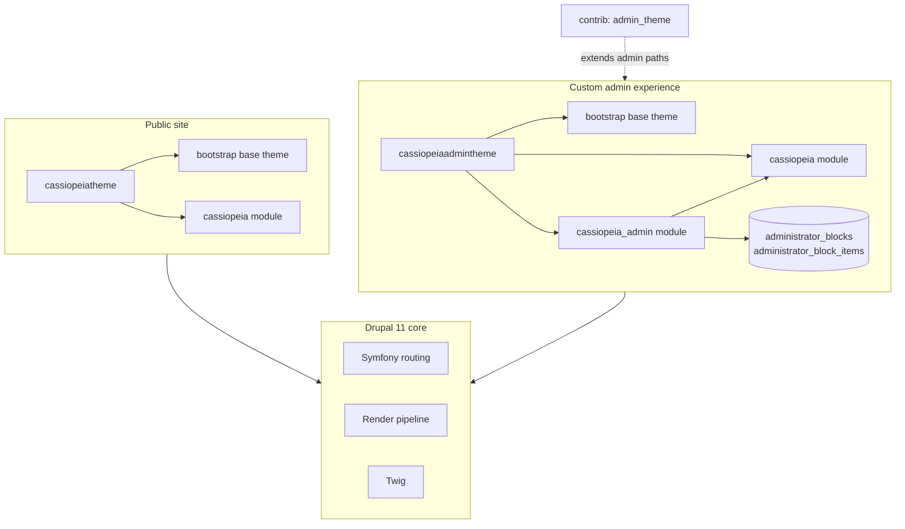

# Drupal 11 Base — Technical Documentation

This document describes the architecture of the **Drupal11Base** project, with emphasis on the custom **Cassiopeia** stack: modules `cassiopeia`, `cassiopeia_admin`, and themes `cassiopeiatheme`, `cassiopeiaadmintheme`.

---

## Table of contents

1. [Project overview](#1-project-overview)
2. [Directory layout](#2-directory-layout)
3. [Architecture diagram](#3-architecture-diagram)
4. [Dependency graph](#4-dependency-graph)
5. [Module: cassiopeia](#5-module-cassiopeia)
6. [Module: cassiopeia_admin](#6-module-cassiopeia_admin)
7. [Theme: cassiopeiatheme](#7-theme-cassiopeiatheme)
8. [Theme: cassiopeiaadmintheme](#8-theme-cassiopeiaadmintheme)
9. [Request and rendering flow](#9-request-and-rendering-flow)
10. [Database schema](#10-database-schema)
11. [Routes and permissions](#11-routes-and-permissions)
12. [Contrib extensions](#12-contrib-extensions)
13. [Configuration and deployment](#13-configuration-and-deployment)
14. [Known gaps and technical debt](#14-known-gaps-and-technical-debt)
15. [Development checklist](#15-development-checklist)

---

## 1. Project overview

| Property | Value |
|----------|--------|
| **Drupal core** | 11.x (`drupal/core-recommended ^11.0`) |
| **Project template** | `drupal/legacy-project` (Composer web root = repository root) |
| **PHP mail** | `phpmailer/phpmailer` ^6.9 (lock: 6.12.x) |
| **Custom package** | Cassiopeia (`11.x-1.01`) |

The site is a standard Drupal 11 codebase extended with a **dual-theme** setup:

- **Public front office** → `cassiopeiatheme` (Bootstrap-based, minimal custom layout).
- **Custom administration UI** → `cassiopeiaadmintheme` (Bootstrap + **AdminLTE 4** shell) driven by configurable sidebar data in `cassiopeia_admin`.

Core Drupal still provides content, users, Views, and configuration; Cassiopeia layers presentation helpers (Twig), a custom admin chrome, and database-backed navigation blocks.

**Related documentation:** `docs/AUDIT_REPORT.md`, `docs/PERFORMANCE_AUDIT_AND_MODERNIZATION.md` (performance sprints 1–5 applied in code).

---

## 2. Directory layout

```
Drupal11Base/
├── core/                          # Drupal 11 core
├── modules/
│   ├── cassiopeia/                # Custom foundation module
│   ├── cassiopeia_admin/          # Custom admin navigation & CRUD
│   └── contrib/                   # Composer/contrib modules
├── themes/
│   ├── cassiopeiatheme/           # Public theme
│   ├── cassiopeiaadmintheme/      # Admin theme (AdminLTE)
│   └── bootstrap/                 # Base theme (contrib)
├── libraries/                     # Front-end libraries (Bootstrap, AdminLTE deps, icons, …)
├── sites/default/                 # Site settings (gitignored when local)
├── vendor/                        # Composer PHP dependencies (gitignored)
├── composer.json
└── docs/
    ├── TECHNICAL_DOCUMENTATION.md   # This file
    ├── AUDIT_REPORT.md
    └── PERFORMANCE_AUDIT_AND_MODERNIZATION.md
```

**Composer installer paths** (from `composer.json`):

| Package type | Install path |
|--------------|--------------|
| `drupal-core` | `core/` |
| `drupal-module` (contrib) | `modules/contrib/{$name}` |
| `drupal-custom-module` | `modules/custom/{$name}` * |
| `drupal-theme` (contrib) | `themes/contrib/{$name}` |
| `drupal-custom-theme` | `themes/custom/{$name}` * |
| `drupal-library` | `libraries/{$name}` |

\* In this repository, custom Cassiopeia code lives directly under `modules/` and `themes/` (not `modules/custom/`), which is valid for a legacy or manually placed layout.

---

## 3. Architecture diagram



**Roles:**

| Layer | Responsibility |
|-------|----------------|
| **cassiopeia** | Shared Twig functions, optional programmatic Twig rendering, demo route `/test` |
| **cassiopeia_admin** | DB-backed admin sidebar groups/items, CRUD UI, permissions, floating “Quản trị” shortcut |
| **cassiopeiatheme** | Public page shell (header / breadcrumb / content / footer) |
| **cassiopeiaadmintheme** | AdminLTE layout, injects dynamic sidebar from `cassiopeia_admin` |

---

## 4. Dependency graph

```
bootstrap (contrib theme)
    ↑
    ├── cassiopeiatheme
    │       └── depends: cassiopeia (module)
    │
    └── cassiopeiaadmintheme
            ├── depends: cassiopeia (module)
            └── depends: cassiopeia_admin (module)

cassiopeia_admin (module)
    ├── depends: drupal:user
    └── depends: drupal:views
```

Both custom themes declare `base theme: bootstrap` and attach their own `global-styling` libraries (Bootstrap JS/CSS paths under `/libraries/`).

---

## 5. Module: cassiopeia

**Path:** `modules/cassiopeia/`  
**Machine name:** `cassiopeia`  
**Package:** Cassiopeia  
**Core:** `^10 || ^11`

### 5.1 Purpose

Foundation module for the Cassiopeia product line. It exposes **Twig helpers** used heavily by `cassiopeiaadmintheme` and provides infrastructure for rendering arbitrary module Twig files outside the normal theme registry.

### 5.2 Services (`cassiopeia.services.yml`)

| Service ID | Class | Role |
|------------|-------|------|
| `cassiopeia.CassiopeiaRenderTemplate` | `Drupal\cassiopeia\Service\CassiopeiaRenderTemplate` | Load and render a Twig file by extension path |
| `cassiopeia.image_builder` | `Drupal\cassiopeia\Service\CassiopeiaImageBuilder` | Build cacheable `image_style` render arrays |
| `cassiopeia.route_subscriber` | `Drupal\cassiopeia\Routing\RouteSubscriber` | Route alterations (currently empty) |
| `cassiopeia.twig_extension` | `Drupal\cassiopeia\TwigExtension\CassiopeiaTwigExtension` | Registers Twig functions (DI: image builder + renderer) |

**Procedural helper** in `cassiopeia.module`: `_cassiopeia_render_template_()` delegates to `cassiopeia.CassiopeiaRenderTemplate` (legacy alias for `/test` and old callers).

### 5.3 Twig extension API

Registered in `CassiopeiaTwigExtension` and callable from any Twig template once the module is enabled:

| Twig function | Description |
|---------------|-------------|
| `cassiopeia_user_load(uid)` | Load user entity by ID |
| `cassiopeia_node_load(nid)` | Load node entity |
| `cassiopeia_term_load(tid)` | Load taxonomy term |
| `cassiopeia_file_load(fid)` | Load file entity |
| `cassiopeia_module_exists(name)` | Check if a module is enabled |
| `cassiopeia_render_template(type, name, path, variables)` | Render extension Twig via service |
| `cassiopeia_image_style_build(style, fid, default_uri, attributes)` | Returns cacheable `image_style` render array (preferred in preprocess) |
| `cassiopeia_image_style(style, fid, default_uri, attributes)` | Renders image style to markup (legacy; uses `renderInIsolation`) |
| `cassiopeia_breadcrumb()` | Current route breadcrumb render array |
| `cassiopeia_url(input, options, check_access)` | Build `Url` from user input |
| `cassiopeia_link(text, input, options, check_access)` | Build `Link` |
| `cassiopeia_form(form_id, ...)` | Build form via `formBuilder` |
| `drupal_form(form_id, ...)` | Alias of `cassiopeia_form` |
| `cassiopeia_menu(menu_name, level, depth, expand)` | Build menu tree for a menu machine name |

These functions keep theme templates thin and avoid repetitive preprocess logic for common entity and URL operations.

### 5.4 Routes

| Route name | Path | Controller | Permission |
|------------|------|------------|------------|
| `cassiopeia.test` | `/test` | `TestController::content` | `administer site configuration` |

`TestController` builds `TestForm`, then renders `templates/test.html.twig` via `cassiopeia.CassiopeiaRenderTemplate` (or `_cassiopeia_render_template_()`). Demo-only; not for public sites.

### 5.5 Theme hook

| Hook | Template | Type |
|------|----------|------|
| `test_form` | `templates/test_form.html.twig` | Form render element |

### 5.6 Database (`cassiopeia.install`)

Defines a `test` table (`id`, `name`) via `hook_schema()`. Nothing in the current module code reads or writes this table; it appears to be scaffolding or legacy.

### 5.7 Route subscriber

`RouteSubscriber::alterRoutes()` contains only commented examples (login path change, logout deny, admin route flag). No active alterations.

---

## 6. Module: cassiopeia_admin

**Path:** `modules/cassiopeia_admin/`  
**Machine name:** `cassiopeia_admin`  
**Dependencies:** `user`, `views`

### 6.1 Purpose

Provides a **custom administration navigation system** independent of Drupal core’s `admin` menu:

1. **Blocks** — top-level sidebar groups (name, icon CSS class, sort position).
2. **Block items** — links under each group (name, internal path, icon, position, parent `bid`).

Administrators with the right permission manage this structure at  
`/admin/cassiopeia/administrator` (and related routes).  
The assembled tree is rendered in `cassiopeiaadmintheme`’s sidebar.

### 6.2 Data model

See [§10 Database schema](#10-database-schema).

**Procedural API** (in `cassiopeia_admin.module`) — thin wrappers delegating to `AdministratorMenuRepository`:

| Function | Action |
|----------|--------|
| `cassiopeia_admin_invalidate_menu_cache()` | Invalidates tag `cassiopeia_admin_menu:list` + request cache |
| `administrator_block_load($id)` | Load block |
| `administrator_block_save($block)` | Save block (invalidates cache) |
| `administrator_block_position_update($id, $position)` | Update block position |
| `administrator_block_delete($id)` | Delete block and items |
| `administrator_block_item_load($id)` | Load item |
| `administrator_block_item_save($item)` | Save item; encodes `url_meta` when link set |
| `administrator_block_item_position_update($id, $position)` | Update item position |
| `administrator_block_item_delete($id)` | Delete item |

**Entity / module hooks** also call `cassiopeia_admin_invalidate_menu_cache()` on `user` and `user_role` changes and on module install/uninstall.

### 6.3 Repository: `cassiopeia_admin.menu_repository`

**Class:** `Drupal\cassiopeia_admin\Repository\AdministratorMenuRepository`

| Method | Behavior |
|--------|----------|
| `loadMenuTreeRows()` | JOIN blocks + items; per-request static cache |
| `loadBlock()` / `loadItem()` | Single record |
| `saveBlock()` / `saveItem()` / deletes / position updates | CRUD + `invalidateMenuCache()` |
| `invalidateMenuCache()` | Clears request cache; invalidates tag `cassiopeia_admin_menu:list` |

### 6.4 Service: `cassiopeia_admin.administrator`

**Class:** `Drupal\cassiopeia_admin\Service\CassiopeiaAdminAdministrator`  
**Implements:** `TrustedCallbackInterface` (lazy builder `lazyBuilder`)

| Method | Behavior |
|--------|----------|
| `cassiopeia_admin_get_items_all()` | Delegates to `loadMenuTreeRows()` |
| `cassiopeia_admin_get_administrator_menu()` | Wrapper with `#lazy_builder`, cache max-age **3600**, tag `cassiopeia_admin_menu:list` |
| `lazyBuilder()` | Builds `#type` => `link` render arrays; active route from `url_meta`; `#theme` => `cassiopeia_admin_administrator_menu` with `#blocks` |

**Alter hooks** (both invoked): `hook_cassiopeia_admin_menu_blocks_alter()` and legacy `hook_cassiopeia_admin_menu_alter()`. See `cassiopeia_admin.api.php`.

**Link metadata:** `AdministratorLinkMetadata` stores encoded route data in `url_meta` at save time to avoid per-request `path.validator` loops.

### 6.5 Event subscriber

**Class:** `Drupal\cassiopeia_admin\EventSubscriber\MenuCacheInvalidatorSubscriber`

Invalidates menu cache on `RoutingEvents::FINISHED` and on config save for `system.site`, `language.*`, `locale.*`.

### 6.6 Param converters

| Service | Type | Loads |
|---------|------|--------|
| `cassiopeia_admin.param_converter.administrator_block` | `administrator_block` | Block record |
| `cassiopeia_admin.param_converter.administrator_block_item` | `administrator_block_item` | Item record |

### 6.7 Controllers and forms

**Base controller:** `CassiopeiaAdminAdministratorController`  
Renders the blocks management page with two forms:

- `CassiopeiaAdminAdministratorBlockAddForm`
- `CassiopeiaAdminAdministratorBlocksForm` (list + tabledrag reorder)

**Specialized controllers** (thin wrappers loading entities and selecting theme hooks):

| Controller | Theme wrapper |
|------------|---------------|
| `CassiopeiaAdminAdministratorBlocksController` | Extends base (same content) |
| `CassiopeiaAdminAdministratorBlockEditController` | `cassiopeia_admin_administrator_block_edit_page` |
| `CassiopeiaAdminAdministratorBlockDeleteController` | `cassiopeia_admin_administrator_block_delete_page` |
| `CassiopeiaAdminAdministratorBlockItemsController` | `cassiopeia_admin_administrator_block_items_page` |
| `CassiopeiaAdminAdministratorBlockItemEditController` | `cassiopeia_admin_administrator_block_item_edit_page` |
| `CassiopeiaAdminAdministratorBlockItemDeleteController` | `cassiopeia_admin_administrator_block_item_delete_page` |

Forms attach JavaScript libraries from `cassiopeia_admin.libraries.yml` for icon picker / table UI behavior.

### 6.8 Theme system (`hook_theme`)

Templates live under `modules/cassiopeia_admin/templates/` with kebab names, e.g.:

- `cassiopeia-admin-administrator-blocks-page.html.twig`
- `cassiopeia-admin-administrator-menu.html.twig`

Preprocess logic for draggable tables is in `cassiopeia_admin.theme.inc`:

- `template_preprocess_cassiopeia_admin_administrator_blocks_form`
- `template_preprocess_cassiopeia_admin_administrator_block_items_form`

The menu template iterates `#blocks` (labels, icon classes, link render arrays) and outputs AdminLTE-compatible `<ul class="nav sidebar-menu">` markup. Titles are escaped (no `|raw`).

### 6.9 `hook_page_bottom`

For users with permission `cassiopeia admin content manager` **or** `c3s quantri access theme`, on **non-admin** routes, injects a fixed-position link **“Quản trị”** pointing to `/admin` or `/manager` depending on permission.

Uses `\Drupal::service('router.admin_context')->isAdminRoute()` to avoid showing on core admin pages.

### 6.10 Install hook and updates

On install, writes **state** key `admin_theme_path` with newline-separated paths and syncs into `admin_theme.settings:paths` when that config is empty (`cassiopeia_admin_sync_admin_theme_paths()`, update `11002`):

```
administrator
admin
admin/*
manager
manager/*
user
user/*
```

This was likely intended to drive which paths use the administration theme. The contrib **Admin Theme** module uses **config** (`admin_theme.settings: paths`), not this state key — verify integration when configuring the site (see [§13](#13-configuration-and-deployment)).

**Update `11001`:** Adds `url_meta` column and index on `bid`; backfills `url_meta` from existing `link` values via `AdministratorLinkMetadata::encodeStorage()`.

### 6.11 Legacy code

Large portions of `cassiopeia_admin.module`, `t4t_admin.admin.inc`, and `t4t_admin.theme.inc` are **commented Drupal 7** menu/permission implementations. They document migration history but are not active.

---

## 7. Theme: cassiopeiatheme

**Path:** `themes/cassiopeiatheme/`  
**Base theme:** `bootstrap`  
**Depends on module:** `cassiopeia`  
**Version:** 5.0.1

### 7.1 Libraries (`cassiopeiatheme.libraries.yml`)

| Library | Assets |
|---------|--------|
| `global-styling` | `css/app.css`, `js/app.js` |
| `bootstrap` | Bootstrap from `/libraries/bootstrap/` (uses `core/popperjs`) |

**libraries-override:** Disables parent `bootstrap/bootstrap-icons` (public theme does not use `bi-*` classes).

### 7.2 Templates

| Template | Role |
|----------|------|
| `html.html.twig` | Standard Drupal HTML skeleton |
| `page.html.twig` | Wrapper: include header → breadcrumb region → `page.content` → footer |
| `header.html.twig` | Empty structural header container |
| `footer.html.twig` | Empty structural footer container |

`page.html.twig` uses Twig `include` with namespace `@cassiopeiatheme/templates/...`.

### 7.3 PHP (`cassiopeiatheme.theme`)

Defines preprocess hooks for html, page, node, regions, forms, menus, tables, etc. **Most implementations are empty stubs** ready for project-specific logic. No admin menu integration on the public theme.

### 7.4 Regions

Inherits Bootstrap’s region layout from the base theme; `page.html.twig` primarily uses the `content` and `breadcrumb` areas.

---

## 8. Theme: cassiopeiaadmintheme

**Path:** `themes/cassiopeiaadmintheme/`  
**Base theme:** `bootstrap`  
**Depends on:** `cassiopeia`, `cassiopeia_admin`  
**Version:** 5.0.1

### 8.1 Libraries (`cassiopeiaadmintheme.libraries.yml`)

| Library | Role |
|---------|------|
| `critical-admin` | Above-the-fold layout CSS (weight −200) |
| `bootstrap-icons-subset` | Subset of Bootstrap Icons (~60 glyphs) instead of full 84 KB font CSS |
| `adminlte` | `adminlte.css`, deferred `adminlte.js` |
| `admin-app` | `app.css`, deferred `app.js` |
| `global-styling` | Depends on critical + icons + admin-app |
| `overlayscrollbars` | Sidebar scroll (deferred JS) |
| `bootstrap` | Bootstrap JS/CSS |

**libraries-override:** Disables `bootstrap/bootstrap-icons`; subset loaded from theme. `page_attachments_alter` strips any remaining full icon library attachment.

### 8.2 AdminLTE layout

`cassiopeiaadmintheme_preprocess_html()` adds body classes:

- `layout-fixed`
- `sidebar-expand-lg`
- `bg-body-tertiary`

`page.html.twig` composes the AdminLTE 4 structure:

```
app-wrapper
├── header.html.twig          (top navbar, user dropdown)
├── appsidebar.html.twig      (brand, user panel, administrator_menu)
├── app-main
│   ├── app-content-header    (title + breadcrumbs)
│   └── app-content           (messages, highlighted, content)
├── footer.html.twig
└── controlsidebar.html.twig
```

### 8.3 Administrator menu injection

```php
// cassiopeiaadmintheme_preprocess_page()
$variables['administrator_menu'] = \Drupal::service('cassiopeia_admin.administrator')
  ->cassiopeia_admin_get_administrator_menu();
// Avatars: cassiopeiaadmintheme_build_user_avatar() → cassiopeia.image_builder
```

`appsidebar.html.twig` outputs `{{ administrator_menu }}` inside `<nav class="mt-2">`. User avatars are built in preprocess as cacheable render arrays (not Twig `user_load`).

### 8.4 Twig usage in admin templates

`page.html.twig` and `header.html.twig` use preprocess variables `account`, `account_avatar_header`, `account_avatar_sidebar` (image style `style_200x200`). Avoid `cassiopeia_user_load()` in production templates when possible.

### 8.5 Optional block configuration

`config/optional/block.block.cassiopeiaadmintheme_*.yml` ships default block placements when the theme is installed (content, breadcrumbs, messages, menus, local tasks, etc.).

### 8.6 Custom regions (`cassiopeiaadmintheme.info.yml`)

| Region | Usage in templates |
|--------|-------------------|
| `breadcrumbs` | `page.breadcrumbs` in content header |
| `status_messages` | Flash messages |
| `content` | Primary page output |
| `footer` | Theme footer include |
| `highlighted` | Optional highlighted region |

### 8.7 UI polish

`cassiopeiaadmintheme_preprocess_menu_local_action()` adds Bootstrap class `btn-sm` to local action links.

---

## 9. Request and rendering flow

### 9.1 Public page

```
HTTP request
  → Drupal kernel / routing
  → Controller or View / node view
  → Main content render array
  → Theme: cassiopeia (default)
  → page.html.twig (header, breadcrumb, content, footer)
  → cassiopeia Twig functions available if templates use them
```

### 9.2 Custom admin page (e.g. content management under custom paths)

```
HTTP request (path matched as admin via core or admin_theme contrib)
  → Administration theme: cassiopeiaadmintheme
  → preprocess_page: load administrator_menu (lazy builder)
  → page.html.twig + appsidebar (DB-driven menu)
  → Main content (Views, entities, cassiopeia_admin forms, etc.)
```

### 9.3 Managing sidebar structure

```
User with "cassiopeia admin block manager"
  → /admin/cassiopeia/administrator
  → CassiopeiaAdminAdministratorController
  → Block add form + blocks list form (tabledrag)
  → POST → repository save / position updates → cache tag invalidated
  → Sidebar on next request: render cache hit or lazyBuilder rebuild
```

---

## 10. Administrator menu storage (config entities)

Menu blocks and items are **config entities** (exportable via Configuration Management). Legacy SQL tables are migrated by `cassiopeia_admin_update_11003()` and dropped by `11004()`.

### 10.1 `administrator_block`

| Config key | Type | Description |
|------------|------|-------------|
| `id` | string | Machine ID (numeric string preserved from legacy DB, e.g. `"1"`) |
| `name` | label | Group label (sidebar section) |
| `icon` | string | CSS icon classes |
| `position` | float | Sort order |

Config name: `cassiopeia_admin.administrator_block.{id}`

### 10.2 `administrator_block_item`

| Config key | Type | Description |
|------------|------|-------------|
| `id` | string | Machine ID |
| `block_id` | string | Parent block ID (legacy column `bid`) |
| `name` | label | Link label |
| `link` | string | Internal path |
| `icon` | string | CSS icon classes |
| `position` | float | Sort order within block |
| `url_meta` | string (nullable) | Serialized route metadata (`AdministratorLinkMetadata`) |

Config name: `cassiopeia_admin.administrator_block_item.{id}`

**Repository:** `AdministratorMenuRepository` loads/saves entities; forms still receive `stdClass` records via `AdministratorRecordMapper`.

### 10.3 `test` (cassiopeia)

| Column | Type |
|--------|------|
| `id` | serial |
| `name` | varchar(255) |

Unused by current application logic.

---

## 11. Routes and permissions

### 11.1 Permissions (`cassiopeia_admin.permissions.yml`)

| Permission | Machine name | Typical use |
|------------|--------------|-------------|
| Cassiopeia admin content manager | `cassiopeia admin content manager` | Floating “Quản trị” link → `/admin` |
| Cassiopeia admin block manager | `cassiopeia admin block manager` | Sidebar CRUD UI |

Both use `restrict access: true`.

| Cassiopeia manager theme access (legacy) | `c3s quantri access theme` | Floating “Quản trị” link → `/manager` |

Block items are validated against their parent block (`bid`) in the param converter, repository, and forms to prevent cross-block IDOR (audit S-06).

### 11.2 Routes (`cassiopeia_admin.routing.yml`)

| Route | Path | Note |
|-------|------|------|
| `cassiopeia_admin.administrator` | `/admin/cassiopeia/administrator` | Block manager home |
| `cassiopeia_admin.administrator_block` | `/admin/cassiopeia/administrator/blocks` | Alias listing |
| `cassiopeia_admin.administrator_block_delete` | `/admin/cassiopeia/administrator/block/{administrator_block}/delete` | |
| `cassiopeia_admin.administrator_block_edit` | `.../edit` | |
| `cassiopeia_admin.administrator_block_items` | `.../items` | Manage links in block |
| `cassiopeia_admin.administrator_block_item_delete` | `/admin/cassiopeia/administrator/block/{administrator_block}/item/{administrator_block_item}/delete` | |
| `cassiopeia_admin.administrator_block_item_edit` | `/admin/cassiopeia/administrator/block/{administrator_block}/item/{administrator_block_item}/edit` | |

Route options declare param converters (`type: administrator_block` / `administrator_block_item`). Services are registered in `cassiopeia_admin.services.yml`.

---

## 12. Contrib extensions

Installed under `modules/contrib/` (representative set):

| Module | Role relative to Cassiopeia |
|--------|----------------------------|
| **bootstrap** (theme) | Parent theme for both Cassiopeia themes |
| **admin_theme** | Extends which paths use the admin theme (config-driven paths) |
| **admin_toolbar** | Enhanced Drupal toolbar |
| **pathauto** | URL aliases |
| **token** | Token API for metatag and other modules |
| **metatag** | SEO meta tags (+ many submodules) |
| **color_field** | Color field type |
| **imce** | File browser |
| **smtp** | SMTP mail |
| **views_entity_form_field** | Views form integration |

These are standard Drupal extensions; they are not hard-required by Cassiopeia modules except where site builders enable and configure them.

---

## 13. Configuration and deployment

### 13.1 Gitignored paths (`.gitignore`)

- `vendor/`
- `sites/*/settings*.php`, `services*.yml`
- `sites/*/files`, `sites/*/private`
- `.env`, IDE folders, `node_modules/`, SQL dumps

### 13.2 Recommended site setup

1. **Install Drupal 11** and enable modules: `cassiopeia`, `cassiopeia_admin`.
2. Set **default theme** → `cassiopeiatheme`.
3. Set **administration theme** → `cassiopeiaadmintheme`.
4. Enable **Admin Theme** contrib and configure **Include paths** to match routes that should use the admin theme (align with paths from `cassiopeia_admin_install()` or your custom `administrator` / `manager` paths).
5. Grant permissions to appropriate roles.
6. Create image style **`style_200x200`** (referenced in admin templates).
7. Place default files: `public://default.png` for avatar fallback.
8. Run `drush updb -y` after pulling `cassiopeia_admin` updates (e.g. `hook_update_11001` for `url_meta`).
9. Run `drush cr` after code, route, or library changes.
10. Enable CSS/JS aggregation in production (`system.performance`).

### 13.3 Libraries

Front-end dependencies are expected under `libraries/` (Bootstrap, Popper, OverlayScrollbars, bootstrap-icons, etc.). Themes reference them with absolute web paths such as `/libraries/bootstrap/dist/css/bootstrap.min.css`.

---

## 14. Known gaps and technical debt

| Issue | Impact | Status |
|-------|--------|--------|
| **PHPMailer** | Mail transport security | **Fixed** — `^6.9` / v6.12.0 in lock file |
| **Stored XSS risk** in menu `name` / `icon` if not validated at input | Admin users with block-manager permission | Partially mitigated: icon sanitized at render; escape names in forms |
| **Silent exception swallowing** in repository CRUD | Failed writes appear successful | Open |
| **`admin_theme_path` state** | Admin theme path list | **Fixed** — synced to `admin_theme.settings` when empty |
| **Large commented D7 code blocks** | Maintainer noise | Open |
| **`cassiopeia` `test` table unused** | Schema drift | Open |
| **Config entity export** for administrator blocks | No config sync between environments | Deferred (optional architecture sprint) |
| **`/test` route** | Demo surface | **Fixed** — `administer site configuration` only |
| **Twig `*_load()` helpers** | Entity access not enforced in extension | Open — use preprocess + access checks |
| **FormState `#block` in form state** | Possible AJAX/rebuild issues | Open — prefer `$form_state->set('block', …)` |

### Resolved in performance sprints 1–5

| Former issue | Resolution |
|--------------|------------|
| `_cassiopeia_render_template_()` undefined | Implemented in `cassiopeia.module`; `TestController` uses service |
| Wrong `CassiopeiaRenderTemplate` namespace | Fixed — `Drupal\cassiopeia\Service` |
| Missing param converters | `AdministratorBlock*ParamConverter` registered |
| Route paths without leading `/` | Fixed in `cassiopeia_admin.routing.yml` |
| `{{ dump() }}` in admin page | Removed |
| Menu `max-age: 0` | Cache tag + max-age 3600 + invalidation |
| Item delete deleted block | `administrator_block_item_delete()` + form fix |
| Procedural DB only in `.module` | `AdministratorMenuRepository` + wrappers |
| O(n) `path.validator` in menu | `url_meta` + `AdministratorLinkMetadata` |
| Full bootstrap-icons on every page | Subset on admin; disabled on public |
| No kernel tests | Four kernel tests under `tests/src/Kernel/` |
| `hook_cassiopeia_admin_menu_alter` commented | Restored (+ `hook_cassiopeia_admin_menu_blocks_alter`) |

---

## 15. Development checklist

### Completed (sprints 1–5)

- [x] Menu render cache (tags, max-age, lazy builder)
- [x] `AdministratorMenuRepository` and DI
- [x] Param converters and route path fixes
- [x] `url_meta` column + `hook_update_11001`
- [x] Remove `dump()`; AdminLTE library split + defer JS
- [x] Bootstrap Icons subset (admin); disable full pack on public
- [x] Critical admin CSS; avatar via `CassiopeiaImageBuilder`
- [x] Menu cache event subscriber + entity/module invalidation hooks
- [x] Kernel tests (cache, lazy builder, alter hooks, entity invalidation)
- [x] Restore menu alter hooks

### Remaining

- [x] Upgrade PHPMailer to supported 6.9.x+
- [ ] Sanitize/validate menu fields at form level; audit `#markup` in list forms
- [ ] Replace silent `catch` in repository with logging or rethrow
- [x] Wire `admin_theme_path` → `admin_theme.settings` (when paths empty)
- [x] Restrict `/test` (administer site configuration)
- [ ] Refactor FormState storage off `#block` keys
- [ ] Remove dead D7 files (`t4t_admin.*`) and large comment blocks
- [ ] Evaluate config entities for block export (optional)
- [ ] Production: aggregation, Blackfire baseline, Views cache audit

---

## Appendix A — File reference (custom stack)

### cassiopeia

```
cassiopeia.info.yml
cassiopeia.module
cassiopeia.install
cassiopeia.routing.yml
cassiopeia.services.yml
src/Controller/TestController.php
src/Form/TestForm.php
src/Routing/RouteSubscriber.php
src/Service/CassiopeiaRenderTemplate.php
src/Service/CassiopeiaImageBuilder.php
src/TwigExtension/CassiopeiaTwigExtension.php
templates/test.html.twig
templates/test_form.html.twig
```

### cassiopeia_admin

```
cassiopeia_admin.info.yml
cassiopeia_admin.module
cassiopeia_admin.api.php
cassiopeia_admin.install
cassiopeia_admin.routing.yml
cassiopeia_admin.services.yml
cassiopeia_admin.permissions.yml
cassiopeia_admin.libraries.yml
cassiopeia_admin.theme.inc
src/Repository/AdministratorMenuRepository.php
src/Service/CassiopeiaAdminAdministrator.php
src/Service/AdministratorLinkMetadata.php
src/EventSubscriber/MenuCacheInvalidatorSubscriber.php
src/ParamConverter/AdministratorBlockParamConverter.php
src/ParamConverter/AdministratorBlockItemParamConverter.php
src/Controller/*.php
src/Form/*.php
templates/*.html.twig
js/*.js
tests/src/Kernel/*.php
tests/modules/cassiopeia_admin_test/
```

### cassiopeiatheme

```
cassiopeiatheme.info.yml
cassiopeiatheme.theme
cassiopeiatheme.libraries.yml
theme-settings.php
templates/*.html.twig
css/app.css
js/app.js
```

### cassiopeiaadmintheme

```
cassiopeiaadmintheme.info.yml
cassiopeiaadmintheme.theme
cassiopeiaadmintheme.libraries.yml
theme-settings.php
config/optional/block.block.*.yml
templates/*.html.twig
css/adminlte.css
css/critical-admin.css
css/bootstrap-icons-subset.css
css/app.css
js/adminlte.js
js/app.js
```

*(Subset rebuild script: `scripts/build-bootstrap-icons-subset.py` at repo root.)*

---

*Document maintained with codebase. Last aligned with performance sprints 1–5. Drupal core: [Drupal.org documentation](https://www.drupal.org/documentation).*
